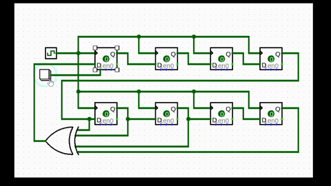

<h1 align="center">
    
</h1>

<h3 align="center">Electrical & Computer Engineering | VLSI - Physical Design | Potential Quantitative Development</h3>

 

I am a third-year Electrical and Computer Engineering student at the University of Cape Town.   
At its core, I am curious about how systems operate at the bare-metal level, rooted in the reality that hardware rules the world. I find that kind of stuff super cool and I feel we take it for granted. So I have decided I'll dedicate my life to understanding how it works and to build stuff with it! My focus lies at the intersection of physical hardware design (ASIC, FPGA, VLSI) and ultra-low latency execution.
  
Currently, I am expanding my physical architecture knowledge into the realm of C++ quantitative development, building my way to the deterministic engines that interact with hardware at the speed of light, starting right from the beginning.

 
 

 
  
  

 
<h2 align="center">Languages & Tools</h2>
 

    <!-- Standard Software Icons -->
    
      
    <!-- Hardware/HDL Badges -->
    
    

 

  <h2>Hardware State</h2>
   
  
Look at this 8-bit Linear Feedback Shift Register (LFSR) I built from scratch in Logisim! I injected a <code>1</code> into the first edge-triggered flip-flop to seed the engine, and watched it immediately cascade through a 4-input XOR gate to generate a chaotic pseudo-random sequence. Bare-metal logic at its finest.

   
  
     

